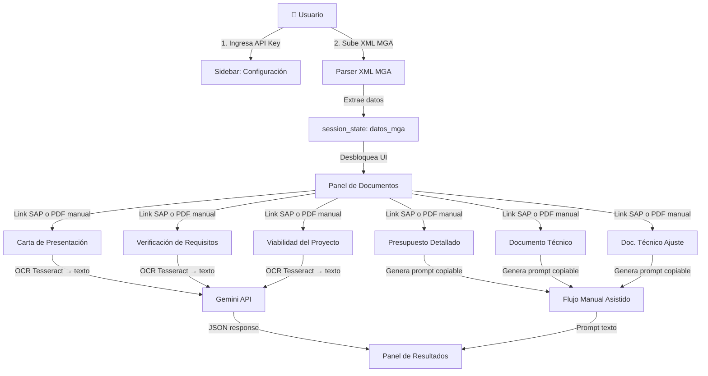
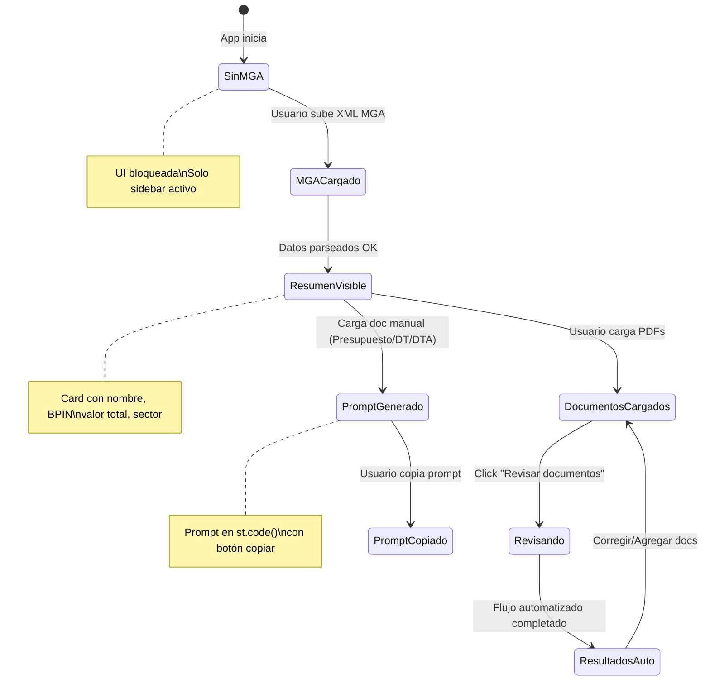

# Revisor de Documentos de Inversión Pública — Plan de Implementación (v2)

Aplicación Streamlit que automatiza la validación de documentos de proyectos de inversión pública radicados en SAP ante el DAP de la Gobernación del Valle del Cauca.

---

## Cambios respecto a v1

- ✅ XML MGA confirmado como archivo estructurado — mapeados todos los campos reales del XML ejemplo
- ✅ Tesseract OCR disponible en `C:\Program Files\Tesseract-OCR\tesseract.exe`
- ✅ Carpetas `documento_tecnico/` y `documento_tecnico_ajuste/` corregidas
- ✅ **Validación de firmas eliminada** de todos los flujos — es responsabilidad del revisor humano
- ✅ Entorno virtual incluido en los pasos de setup
- ✅ Estrategia OCR → texto a Gemini (no PDF binario) para ahorrar tokens

---

## Arquitectura General



---

## Mapeo de Campos del XML MGA

Basado en el análisis del archivo [MGA-ejemplo.xml](file:///d:/ICESI/Semestre10/practica/inversion/revision-documentacion-sap/MGA-ejemplo.xml):

| Campo para validación | XPath en el XML |
|---|---|
| Nombre del proyecto | `Project/Name` |
| BPIN | `Project/BPIN` |
| Objetivo general | `Project/GeneralObjective/GeneralObjective` |
| Sector | `Project/Sector/Description` |
| Entidad | `Project/Entity/Name` |
| Programa | `Project/Program` |
| Población afectada | `Project/AffectedPeople` |
| Población objetivo | `Project/ObjectivePeople` |
| Problema central | `Project/CentralProblem/CentralProblem` |
| Vigencia (año base) | `Project/PeriodZero` |
| Causas directas | `Project/CentralProblem/Causes/Cause[CauseEffectTypeId=1]/Description` |
| Causas indirectas | `Project/CentralProblem/Causes/Cause[CauseEffectTypeId=3]/Description` |
| Objetivos específicos | `Project/CentralProblem/Causes/Cause/SpecificObjective/SpecificObjective` |
| Productos (nombre) | `Project/Alternatives/Alternative[IsSelected=1]/Products/Product/ProductName` |
| Productos (meta) | `...Product/Amount` |
| Productos (indicador) | `...Product/AutoIndicatorName` |
| Actividades (nombre) | `...Product/Activities/Activity/Name` |
| Actividades (costo) | `...Product/Activities/Activity/Cost` |
| Valor total del proyecto | Σ de todos los `Activity/Cost` de la alternativa seleccionada |
| Fuente de financiación | `Project/FundingSource/Sources/Source/ResourceType/Description` |
| Monto por fuente/periodo | `...Source/SourceProgrammings/SourceProgramming/Amount` |
| Localización (departamento) | `Project/Localizations/Localization/Department/Name` |
| Localización (municipio) | `Project/Localizations/Localization/Municipality/Name` |
| Plan de desarrollo | `Project/PublicationContribution/DevelopmentPlan` |
| Indicadores de gestión | `Project/ManagementIndicators/ManagementIndicator/Description` |
| Riesgos | `Project/Alternatives/Alternative[IsSelected=1]/Risks/Risk` |
| Demografía | `Project/DemographicCharacteristics/DemographicCharacteristic` |

---

## Proposed Changes

### Paso 0: Setup del Entorno

```bash
# Crear entorno virtual en la raíz del proyecto
python -m venv venv

# Activar (Windows PowerShell)
.\venv\Scripts\Activate.ps1

# Instalar dependencias
pip install -r requirements.txt
```

---

### Módulo 1: Configuración y Punto de Entrada

#### [NEW] [app.py](file:///d:/ICESI/Semestre10/practica/inversion/revision-documentacion-sap/app.py)

Archivo principal de Streamlit. Contiene:
- Configuración de página (`st.set_page_config`)
- CSS personalizado con UX profesional (badges de estado, cards por documento, paneles expandibles)
- Inicialización de `st.session_state`: api_key, credenciales SAP, datos_mga, documentos cargados, resultados
- Layout: sidebar (API key, credenciales SAP, carga XML MGA) + área central (documentos + resultados)
- **Bloqueo de UI**: sin XML MGA cargado, toda la sección de documentos queda deshabilitada
- Lógica de flujo por documento:
  - Carta, Verificación, Viabilidad → botón "Revisar" que ejecuta flujo automatizado
  - Presupuesto, Doc. Técnico, Doc. Técnico Ajuste → genera prompt copiable al cargar el documento

#### [NEW] [requirements.txt](file:///d:/ICESI/Semestre10/practica/inversion/revision-documentacion-sap/requirements.txt)

```
streamlit>=1.30
google-genai
requests
pypdf
python-dotenv
lxml
pytesseract
Pillow
pdf2image
```

> **Nota**: `pytesseract` requiere Tesseract instalado en el sistema. Ya está en `C:\Program Files\Tesseract-OCR\tesseract.exe`.  
> `pdf2image` requiere Poppler. Se incluirá como dependencia portátil o se documentará la instalación.

#### [NEW] [.env.example](file:///d:/ICESI/Semestre10/practica/inversion/revision-documentacion-sap/.env.example)

```env
# Opcional: si prefieres no ingresar la key en la UI cada vez
GEMINI_API_KEY=tu_api_key_aqui
# Modelo por defecto (se recomienda flash-lite por los límites de cuota)
GEMINI_MODEL=models/gemini-3.1-flash-lite
```

---

### Módulo 2: Parser de XML MGA

#### [NEW] [mga_parser.py](file:///d:/ICESI/Semestre10/practica/inversion/revision-documentacion-sap/mga_parser.py)

Parsea el XML usando `xml.etree.ElementTree` (stdlib, sin dependencia extra). Funciones:

- `parsear_mga_xml(xml_bytes: bytes) -> dict`: Retorna diccionario con todos los campos mapeados arriba.
- `calcular_valor_total(datos: dict) -> float`: Suma los costos de todas las actividades de la alternativa seleccionada.
- `formatear_datos_mga_para_prompt(datos: dict) -> str`: Genera texto legible con los datos clave para inyectar en prompts.
- `formatear_datos_mga_resumen(datos: dict) -> dict`: Versión resumida para mostrar en la UI (card de resumen del proyecto).

Campos extraídos (según mapeo de la tabla anterior):
- `nombre_proyecto`, `bpin`, `objetivo_general`, `sector`, `entidad`
- `periodo_cero` (vigencia base), `programa`
- `poblacion_afectada`, `poblacion_objetivo`
- `problema_central`, `causas_directas`, `causas_indirectas`
- `objetivos_especificos`
- `productos` (lista de dicts con nombre, meta, indicador, actividades)
- `actividades` (lista de dicts con nombre, costo)
- `valor_total` (calculado como Σ costos de actividades)
- `fuentes_financiacion` (lista con tipo y monto)
- `localizacion` (departamento, municipio, zona)
- `plan_desarrollo`, `indicadores_gestion`, `riesgos`, `demografia`

---

### Módulo 3: OCR de Documentos PDF

#### [NEW] [ocr_processor.py](file:///d:/ICESI/Semestre10/practica/inversion/revision-documentacion-sap/ocr_processor.py)

Módulo para extraer texto de PDFs (escaneados o digitales):

- Configura Tesseract: `pytesseract.tesseract_cmd = r'C:\Program Files\Tesseract-OCR\tesseract.exe'`
- `extraer_texto_pdf(pdf_bytes: bytes) -> str`:
  1. Primero intenta extraer texto con `pypdf` (PDFs digitales — gratis, rápido)
  2. Si el texto extraído está vacío o es muy corto (<100 chars), asume PDF escaneado y usa `pdf2image` + `pytesseract` para OCR
  3. Retorna el texto concatenado de todas las páginas

**Justificación de OCR → texto → Gemini** (en vez de enviar PDF como bytes):
- Enviar texto extraído gasta **mucho menos tokens** que enviar el PDF binario
- Tesseract ya está disponible en la máquina
- Con los límites de 250k TPM, enviar texto es más seguro que enviar un PDF de varias páginas como imagen
- Si el OCR falla en alguna página, se incluye un marcador `[PÁGINA X: texto no extraíble]` para que Gemini sepa

---

### Módulo 4: Descarga desde SAP

#### [NEW] [sap_client.py](file:///d:/ICESI/Semestre10/practica/inversion/revision-documentacion-sap/sap_client.py)

Sin cambios respecto a v1:
- `descargar_documento_sap(url, usuario, password) -> tuple[bytes, str]`
- Manejo de errores (401, 404, timeout)
- Validación de magic bytes `%PDF`

---

### Módulo 5: Motor de Revisión Automatizada (API Gemini)

#### [NEW] [revision_automatizada.py](file:///d:/ICESI/Semestre10/practica/inversion/revision-documentacion-sap/revision_automatizada.py)

Motor para: **Carta de Presentación**, **Verificación de Requisitos**, **Viabilidad**.

**Cambios respecto a v1:**
- Recibe **texto OCR** en vez de PDF bytes → se inyecta como texto en el prompt
- **Sin validación de firmas** — se elimina de los prompts enviados a Gemini
- Se inyectan los datos del XML MGA como contexto textual

**Pipeline por documento:**
1. `ocr_processor.extraer_texto_pdf(pdf_bytes)` → texto del documento
2. `_construir_prompt(formato_dir, datos_mga, texto_documento)` → prompt completo
3. `client.models.generate_content(model, prompt, config=json)` → respuesta JSON
4. Parsear y retornar `{estado, resumen, hallazgos, recomendacion}`

**Estructura del prompt:**
```
[System] {contenido de prompt.md SIN las secciones de firmas} + {contenido de formato.md SIN firmas}

[User] 
--- DATOS DEL PROYECTO (MGA) ---
{datos extraídos del XML en formato legible}

--- TEXTO DEL DOCUMENTO ---
{texto extraído por OCR}

Revisa el documento siguiendo las instrucciones del sistema. NO valides firmas.
```

**Modelo**: `models/gemini-3.1-flash-lite` (15 RPM, 500 RPD)

**Manejo de errores de cuota (HTTP 429):**
- Detecta `google.api_core.exceptions.ResourceExhausted` o status 429
- Muestra mensaje: "Se alcanzó el límite de la API key actual. Ingrese una nueva key en la barra lateral."
- No interrumpe el resto de la sesión

**1 llamada por documento** — prompt ya contiene toda la lista de validaciones.

---

### Módulo 6: Generador de Prompts para Flujo Manual Asistido

#### [NEW] [prompt_generator.py](file:///d:/ICESI/Semestre10/practica/inversion/revision-documentacion-sap/prompt_generator.py)

Para: **Presupuesto**, **Documento Técnico**, **Documento Técnico de Ajuste**.

- `generar_prompt_manual(tipo_documento: str, datos_mga: dict, formato_dir: Path) -> str`:
  1. Lee `prompt.md` del formato correspondiente (eliminando secciones de firmas)
  2. Lee `formato.md` del formato correspondiente (eliminando secciones de firmas)
  3. Genera bloque con datos MGA extraídos del XML
  4. Construye prompt completo con instrucciones claras:
  
```
=== INSTRUCCIONES PARA EL REVISOR ===
Copia TODO este prompt y pégalo en el chat de Gemini (gemini.google.com),
luego adjunta el PDF del [tipo de documento] en el mismo mensaje.

=== DATOS DEL PROYECTO (extraídos del XML MGA) ===
{datos formateados}

=== FORMATO BASE DE REFERENCIA ===
{contenido de formato.md}

=== CRITERIOS DE REVISIÓN ===
{contenido de prompt.md}

IMPORTANTE: NO valides firmas. Enfócate en coherencia de datos, completitud
de secciones y consistencia con los datos de la MGA proporcionados arriba.
```

El prompt se muestra en la UI con `st.code()` y un botón de copiar al portapapeles.

---

### Estructura final del proyecto

```
revision-documentacion-sap/
├── app.py                      # Punto de entrada Streamlit (UI principal)
├── mga_parser.py               # Parser del XML MGA
├── ocr_processor.py            # Extracción de texto de PDFs (pypdf + Tesseract)
├── sap_client.py               # Cliente de descarga SAP
├── revision_automatizada.py    # Motor de revisión con API Gemini
├── prompt_generator.py         # Generador de prompts para flujo manual
├── requirements.txt            # Dependencias
├── .env.example                # Ejemplo de variables de entorno
├── venv/                       # Entorno virtual (no se sube a git)
├── formatos/                   # Ya existente
│   ├── presentacion/
│   ├── verificacion/
│   ├── viabilidad/
│   ├── presupuesto/
│   ├── documento_tecnico/
│   └── documento_tecnico_ajuste/
├── MGA-ejemplo.xml             # Ya existente (referencia)
├── prompt_antigravity.md       # Ya existente
└── puede_servir.py             # Ya existente (referencia)
```

---

## Decisiones de Diseño Clave

### 1. OCR con Tesseract → texto → Gemini (en vez de PDF binario directo)

**Decisión**: Extraer texto con pypdf/Tesseract y enviar texto plano a Gemini.

**Razones**:
- **Ahorro de tokens**: Un PDF de 5 páginas como bytes puede gastar ~50k-100k tokens. El mismo contenido como texto extraído gasta ~2k-5k tokens.
- **Tesseract disponible**: Ya está instalado en la máquina.
- **Más requests posibles**: Con 250k TPM, se pueden procesar más documentos por minuto enviando texto.
- **Fallback**: Si pypdf extrae texto (PDF digital), ni siquiera se necesita Tesseract.

**Trade-off**: Se pierde la capacidad de Gemini de "ver" el layout visual del documento. Pero para las validaciones requeridas (coincidencia de datos, campos faltantes, coherencia), el texto es suficiente.

### 2. Eliminación de validación de firmas

**Decisión**: Eliminar toda mención a firmas en los prompts enviados a Gemini y en los prompts generados para el flujo manual.

**Razones**:
- Ahorra tokens en cada llamada a la API (menos texto en el prompt)
- Reduce false positives (Gemini no es confiable detectando firmas en texto OCR)
- La revisión de firmas es visual y rápida — el revisor la hace mejor manualmente
- Optimiza el uso de la cuota limitada

### 3. Modelo Gemini por tarea

| Tarea | Modelo | Justificación |
|---|---|---|
| Revisión de Carta | `gemini-3.1-flash-lite` | Validación de campos — simple, 500 RPD |
| Revisión de Verificación | `gemini-3.1-flash-lite` | Lista de chequeo — simple |
| Revisión de Viabilidad | `gemini-3.1-flash-lite` | Validación de datos — simple |

### 4. Slots fijos por tipo de documento

Cada proyecto tiene exactamente 6 tipos de documento (o un subconjunto). La UI muestra los 6 como secciones fijas — el usuario carga solo los que aplican. Es más claro que agregar/quitar slots dinámicamente.

### 5. XML MGA como prerequisito obligatorio

La UI bloquea completamente la carga de documentos hasta que el XML esté cargado y parseado exitosamente. Los datos extraídos se muestran en un card de resumen para que el usuario confirme visualmente.

---

## Flujo de la UI



---

## Verification Plan

### Automated Tests
```bash
# Verificar imports
python -c "from mga_parser import parsear_mga_xml; print('mga_parser OK')"
python -c "from ocr_processor import extraer_texto_pdf; print('ocr_processor OK')"
python -c "from revision_automatizada import revisar_documento; print('revision OK')"

# Verificar Tesseract
python -c "import pytesseract; pytesseract.pytesseract.tesseract_cmd = r'C:\\Program Files\\Tesseract-OCR\\tesseract.exe'; print(pytesseract.get_tesseract_version())"

# Iniciar la app
streamlit run app.py
```

### Manual Verification
1. Cargar `MGA-ejemplo.xml` y verificar que los datos se extraen correctamente (nombre, BPIN, valor total)
2. Probar descarga de documento desde SAP con credenciales válidas
3. Probar el flujo automatizado con un PDF de Carta de Presentación
4. Probar el cambio de API key en caliente
5. Simular cuota agotada y verificar el mensaje de error
6. Verificar que los prompts generados para flujo manual contienen los datos MGA correctos
7. Verificar el botón de copiar al portapapeles
